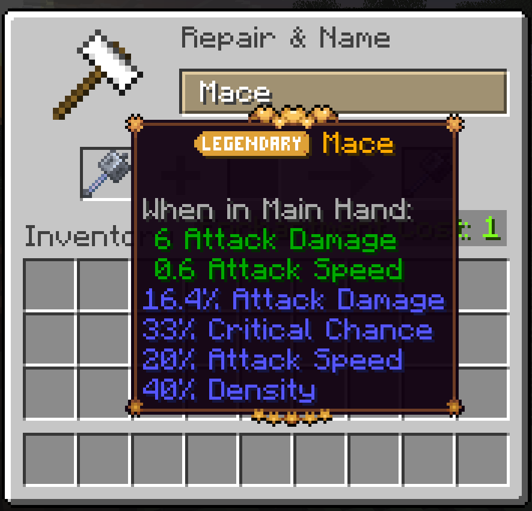
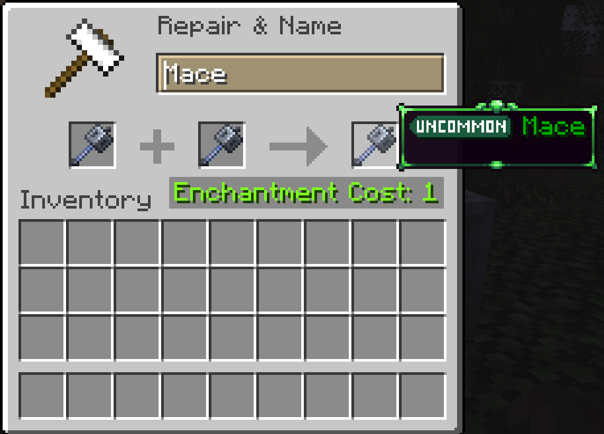
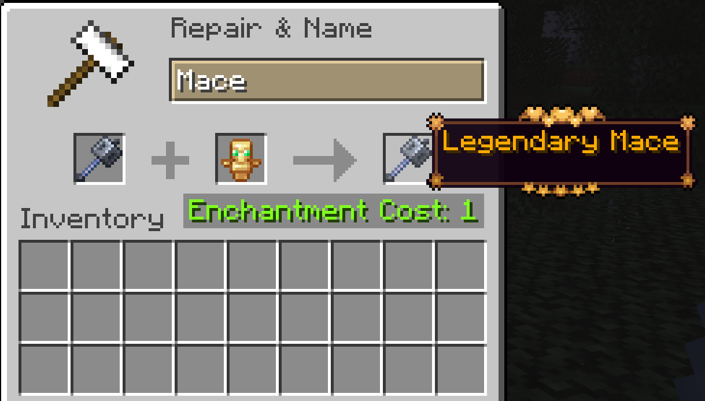
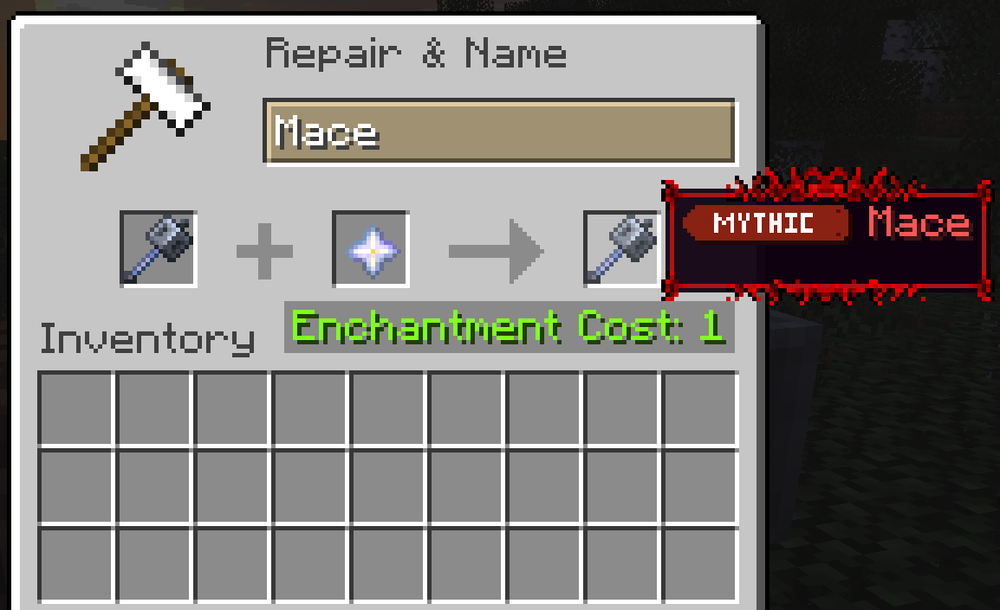
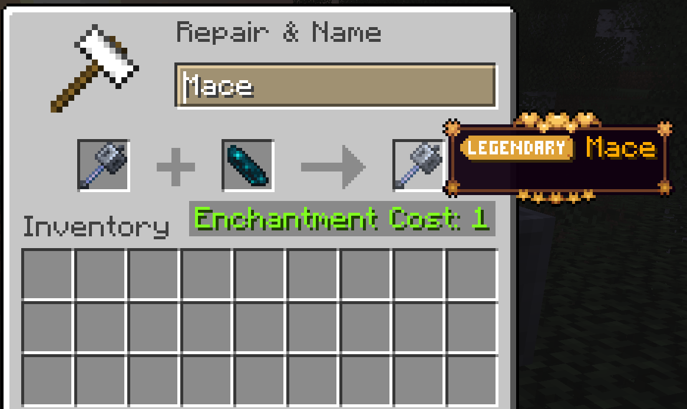

## ToolTiers
ToolTiers brings RPG-style item quality to Minecraft 26.2 on Fabric.

Every tool, weapon, armor piece, and utility item can roll a tier like Common, Rare, Legendary, or Mythic. Better tiers can give stronger bonuses, while lower tiers can come with tradeoffs. The result is a progression loop where gear feels less static and loot feels more exciting.

ToolTiers is a continuation of the Tiered lineage, updated for modern Minecraft with active balancing and expansion.

The original concept is inspired by Quality Tools.

## What You Get In-Game
Randomized gear quality on many item types, not just one category
Meaningful stat variation that changes combat, mining, ranged play, mobility, and survivability
Tiered items from normal gameplay loops like crafting, loot, and mob equipment drops
Custom item name styling and tier-themed tooltip visuals
A reforge system that gives you multiple ways to improve or reroll your item

## Reforge System
You can reforge your items in anvil in four main ways:

# 1. Standard Reforge
Combine two compatible tiered items of the same type.
If both are the same tier, you can upgrade toward the next tier.

# 2. Totem Reforge
Totems of Undying also have tiers.
You can use it as a reforge catalyst.
The totem tier quality is transferred to the item.

# 3. Mythic Upgrade
Use a Nether Star to reforge Legendary items into Mythic tier.

# 4. Attribute Reroll
Use an Echo Shard to reroll attributes while keeping the item tier.

## Installation
Required:

Fabric Loader
Fabric API
Cloth Config
Optional:

Mod Menu

## Customization
ToolTiers is datapack-driven.

# Primary data roots:

data/tiered/item_attributes
data/tiered/modifier_pools
data/tiered/item_attribute_aliases.json
assets/tiered/tooltips

## Credits
Draylar1 (Tiered)
Globox_Z (TieredZ)
Ameisin (Tierify 1.21.1 port)
nvb-uy (Tierify maintenance)
DeGammaGD (ToolTiers continuation and migration)
## License
Source code is licensed under MIT in this repository.
Some non-code assets may remain All Rights Reserved where explicitly stated.

And here is a technical companion document you can place as a separate project doc:

## ToolTiers Technical Notes(for nerds)
Runtime Baseline
Minecraft 26.2
Fabric Loader 0.19.3
Fabric API 0.154.1+26.2
Java 25
Cloth Config 26.2.155
Mod Menu 20.0.0-beta.4
Tier Data Pipeline
Item attribute definitions load from item_attributes.
Modifier pool references are resolved from modifier_pools.
Verifiers decide eligibility by item id, tags, and fallback patterns.
Weighted selection picks a tier id.
Generated rolls are stored on item custom data.
Attribute modifiers are rebuilt from stored generated rolls when needed.

# Important behavior:
Existing generated rolls persist on the item.
Reloads and repair paths rebuild from stored roll data.
Legacy tier ids are bridged through alias mappings.
Data Layout
Tier definitions: data/tiered/item_attributes
Attribute pools: data/tiered/modifier_pools
Compatibility aliases: data/tiered/item_attribute_aliases.json
Tooltip templates: assets/tiered/tooltips/tooltip_borders.json
Lang labels: assets/tiered/lang/en_us.json

# Current Category Coverage
armor
tools
melee_weapons
ranged_weapons
maces
spears
tridents
shields
elytra
fishing_rod
totems
utilities
utilities_shears

# Tier assignment currently occurs in:
Crafting result handling
Loot table output handling
Mob equipment and nearby dropped item handling
Inventory item set paths
Item frame insertion path
Server-side inventory repair/update passes after datapack reload and player join
Reforge Architecture

# Anvil behavior is managed by a recipe manager with four registered recipe types:
Standard reforge recipe
Totem reforge recipe
Nether star mythic upgrade recipe
Echo shard reroll recipe
Preview intentionally hides generated modifiers until result pickup, then attributes are rebuilt before transfer.

# Attribute Systems Wired in Code
Examples currently connected to gameplay:

Critical chance and critical damage
Durability scaling
Protection family percent mitigation
Mining efficiency scaling
Fortune and looting drop multipliers
Reach and spear reach handling
Sweeping range scaling
Ranged power and quick draw
Lucky shot arrow effects
Riptide power and channeling chance
Breach, density, lunge
Elytra glide speed and boost efficiency

# Notes for Pack Authors
Tier ids should match lang label keys for user-facing names.
Modifier pools can be shared or category-specific.
Legacy alias entries should be retained when migrating ids.
Invalid JSON in modifier pools can silently drop expected roll options for that category.